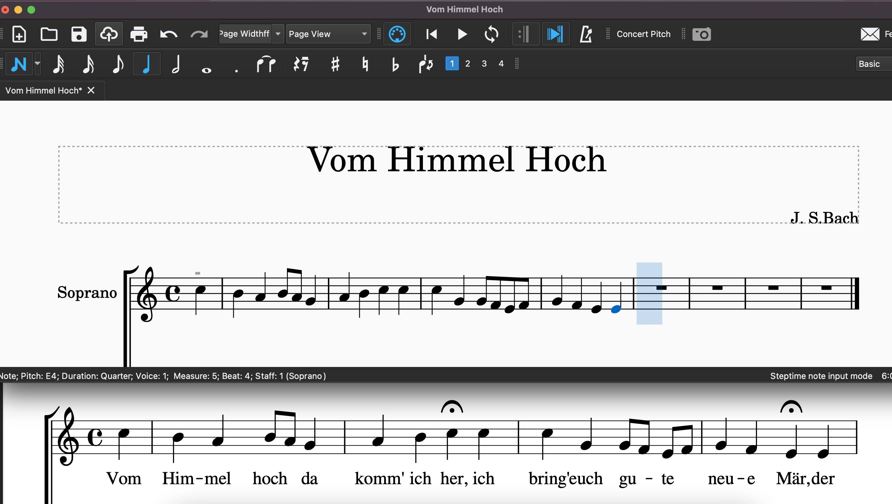

# Practicing choral music with MuseScore

MuseScore is a computer program to write sheet music. It is also excellent to practice choral music. In this tutorial you'll initially learn how to use MuseScore for your choral practice at home. The second part of the tutorial will give an overview on how you can write music in MuseScore if you only have the sheet music and no midi files or dedicated MuseScore files.

## Installation
MuseScore is free. You can download it [here](https://musescore.org/en/download) and follow the installation guide. The installation will differ depending on which operating system you use. After installation you can start MuseScore and should get a start screen similar to this:  


Please note that there is [www.musescore.ORG](https://www.musescore.org) from where you can download the program and there is [www.musescore.COM](https://www.musescore.com) where you can get a paid subscription so you can download existing sheet music. You don't need the paid subscription for sheet music. The sheet music NovoCantare uses is provided to the members and can be found in the Google Drive.

## Practice with MuseScore
In this section you'll learn how to practice your part. You can download the `AveMaria.mscz` file from the Google Drive.

If you're not a member of NovoCantare, you can download the `Ave Maria` sheet music on [MuseScore.com](https://musescore.com/user/5373126/scores/4853136). You can start with a free trial there, so you won't directly need a paid subscription.  


When you open the `AveMaria.mscz` file you can directly play the sheet music by pressing the space bar or the play button. Press the space bar again to stop the music. It's handy to get used to keyboard short-cuts directly in order to get quicker in moving around the sheet.


<!-- add comparison to midi files where you cannot adjust easily for practice -->

### Adjust the volume of a part
Often when practicing a new piece you want to specifically focus on your part. You can increase the volume by opening the `Mixer` under `View/Mixer` and adjusting the volume of your part to enhance the contrast to the other parts. You can also use the green `S` button to only play a single part or use the red `M` button to mute specific other parts.


### Checking your pitch
There are critics on using music software to practice choral music altogether. It's temptative to just sing along a computer voice. It is still very important to eventually know what note will follow another. You can practice this in MuseScore, too. Just press the space bar to pause the playback and sing the following note. You can then click on the note to hear if your pitch was correct.  

You can also use the Mixer's mute functionality (the `M` button mentioned above) for this. During playback, press the mute button for your part, keep on singing and unmute the part again. This way you can practice to stay on pitch.

### Specify the output instrument
In order to more clearly follow a part, you can change the output sound of the part. To adjust the instrument right-click on the instrument name (e.g. `Soprano`) on the top left of your sheet music and choose `Staff/Part Properties`.  
  
A properties window will pop up with a `Change Instrument...` button.  

For practicing choral parts I recommend to change your part to `Alto Saxophone` and the other parts to `Piano`. The Alto Saxophone sound is pleasant to sing along with and subtle Piano accompaniments help to learn your part in context to the other parts.


Note that after changing your part to alto saxophone, the sheet music will look different since the saxophone is a es instrument which means that an `es` sounds when a `c` is played. However, this shouldn't bother you during practice. It's preferrable not to focus on MuseScore's sheet but on your printed sheet music so you're not dependent on the Playback cursor to indicate where on the sheet you are at the moment of singing.

### Loop difficult parts
Practicing means focusing on the difficult parts. In MuseScore you can loop certain notes or measures by shift-selecting them and then toggling the `Loop Playback` button next to the `Play` button.  


### Practice at different speeds
Start slow and increase speed when your pitch and rhythm are solid. You can adjust the overall playback speed by opening the `Play Panel` under `View/Play Panel`. The speed is adjusted percentually to the original playback speed.  


All in all, MuseScore is great to practice your part. It's easy to get started and there are many options to adjust the music. If you haven't done so already: Give it a try!

## Write music
For most pieces, there are already digital versions available that you can practice with. However, for some pieces there is only a pdf version or even just a printed version available.  

You can transcribe the music yourself easily but it can be time-consuming. In this part of the tutorial you'll learn how to efficiently transcribe sheet music so you can spend more time on practicing your singing instead of typing out music.  

For this example, we'll transcribe Bach's "Vom Himmel Hoch". First, open a new file, choose `choral / SATB` and set it up with the correct key and time signature.

<!-- unused screenshot for SATB, probably not necessary to add -->


For pure singing practice the notes in correct rhythm should be sufficient. Therefore, we will focus on this in this tutorial. You can insert all notes by first clicking on the correct rhythm on the note input bar and then clicking the correct pitch on the staff lines. However, this becomes tedious easily.



You can also input notes by using your keyboard. Just type the letter of the note you want to insert. This will give you the correct pitch but at the currently selected duration.  

And this is a bit of a caveat. Before you insert a note by pressing the correct pitch, you should select its duration. This is somewhat counter-intuitive and you simply have to get used to the order. You can choose the duration using the note input bar or by using the number 2-7 on your keyboard. 4 is an eighth note, 5 is a quater note. Hover with your mouse the items in your note input bar to check which number to use.


Since the letters of a normal scale (cdefgabc) can all be typed with your left hand, you can use your right hand to select the durations. 

In the "Vom Himmel Hoch" example the first 4 measures of soprano can be inserted with the following keystrokes:  
```
5 C B A
4 B A
5 G A B C C G
4 G F E F
5 G F E E A A
4 G A
5 B
```

Note: I could have written this as one string but used a new line in the representation to indicate the switches in note durations.

Remember: Always first select the duration and insert the pitch afterrwards!  

The switching between rhythm and pitch can be mentally exhausting. If you need to insert music which has a lot of rhythmic changes, you may prefer inserting the durations first and adjust the pitches later. You can try to insert the alto part this way: First focus on the duration and instead of adding the correct pitch, always use the same pitch. 


The first 4 measures of the alto part would look like this:  

```
5 G
4 G G
5 G G
4 G G
5 G G G G G G G G G G G G
```

Then go back to the beginning of the sheet music and adjust the pitch by pressing the up and down keys to move the notes in place.


You can even save more keystrokes when you switch to `re-pitch` mode in the note input bar. Then you can re-pitch the notes easily by typing their pitch letter instead of pressing the arrow keys several times. When you operate in `re-pitch` mode, the already inserted note durations won't change.


When you're done with your transcription, save the file in the MuseScore `.mscz` file format to make sure all details are saved. Additionally, export the file to `.midi` so other singers can use the practice file even if they don't use MuseScore.

Should you have any questions about MuseScore, feel free to contact me!

<!-- ## MuseScore alternatives
paid version. you can use these programs to practice
Finale, Sibelius
save as other format -->

## More
If you want to learn more about MuseScore, check out the [YouTube videos](https://www.youtube.com/watch?v=YZ4kRzkHroU&list=PLTYuWi2LmaPGb4SKXHm9JULQ-0CH8KpUk) by George Hess. It's a series of small videos that will teach you the MuseScore notation basics.
